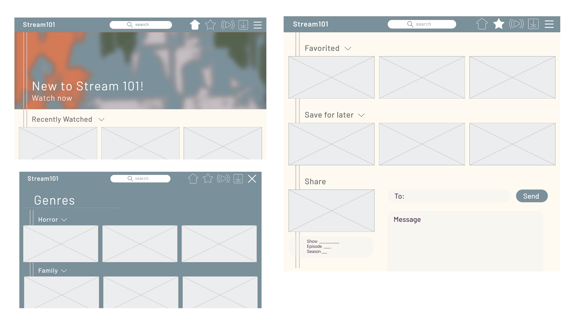
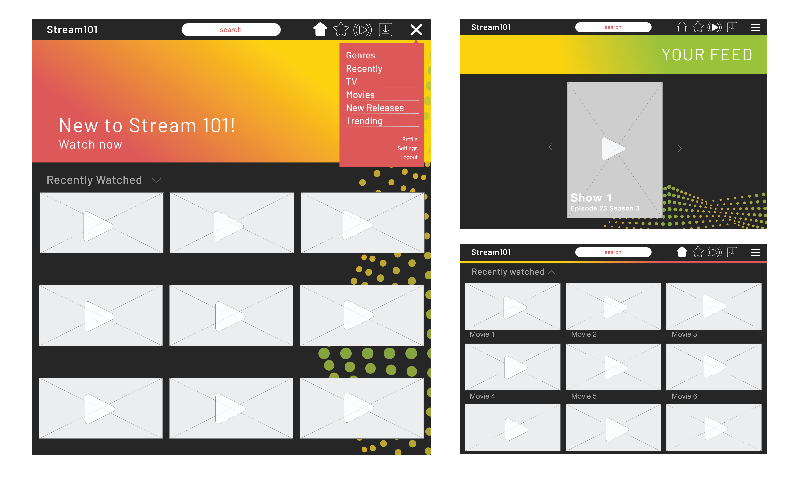
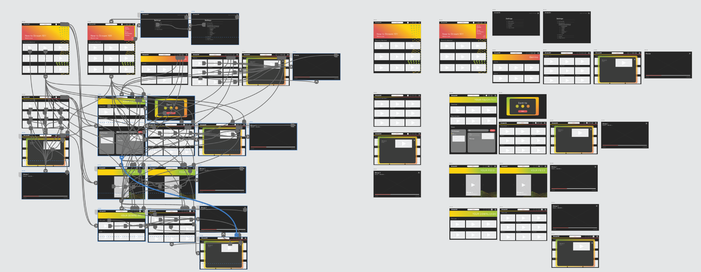

# DH-150-Assignment07

## Introduction:
Assignment 7 goes into the process of a high fidelity prototype. At this point navigation and interaction with the site should be fairly set so now the designer has the opportunity to add flare. With high fidelity prototyping the designer can begin choosing color and type while keeping accessibility and visual compatibility in mind. 

### Tasks
1. Personalize home screen in settings and return to home
2. Access the horror genre and select a show
3. Expand the recently watched menu, switch to favorites in the toolbar and “share a show”
4. Access “your feed” through the live icon in the toolbar and start watching a show

## Potential style guides:

I wanted to take a unique approach to streaming platforms. Normally streaming platforms are set on dark screens to set the ambience of night and relaxation. I attempted to choose color palettes that created the same ambiance but with lighter colors. The user should then feel relaxed but refreshed. I also followed current design trends around mental health, light colors and simple shapes. 

## Prototype 1
### Screen designs:

#### XD link:
pages 21-23 -
https://xd.adobe.com/view/978c6ccb-f665-4482-9b91-80d0e579f15d-c2df/screen/90cf2694-7391-4a4b-ab5b-651f6fced040

I pursued this style guide because it resonated the most with me but also had the most neutral tones. The idea is that anyone would feel compatible with this site and would not be put off by the color combinations. Additionally I have to accommodate inconsistent images associated with the movies shows. 

### Accessibility color check:
Light text on dark background - White (#FFFFFF) on dark blue (#7A8F99)
- 3.37 - Passes AA for large text (above 18pt or bold above 14pt)
- this choice can be used for large text likes titles and decorative type but might be eligible for dense/packed information

Dark text on light background - dark purple (#503957) on light beige (#FFF8ED)
- 9.64 - Passes AAA level for any size text
- This choice was extremely successful legibility but since the type is so dark I might just be safe and change the type to black

Dark text on light background - grey (#707070) on light beige (#FFF8ED)
- 4.69 - Passes AA level for any size text and AAA for large text (above 18pt or bold above 14pt)
- Overall this choice is solid however as a designer I think I could come up with a better color combination

### Impression test:
https://drive.google.com/drive/folders/1Oyl6CizGKUlCM4_WXxi9MnpOiN8jd4jH?usp=sharing

I tested two users, male and female, who reacted similarly showing that my site had specific and clear qualities. The users reacted in a favorable but an unexpected way to my overall design choice. Both users were clear that the site was for streaming movies/shows and that it was simple and easy to use. However, the users inferred that the site was for younger audiences, specifically children, instead of a middle aged audience. This was unexpected but I can see how my color choices may not give off a mature look and feel. 

## Prototype 2
  
After the impression test I decided I wanted to change the look completely to fit the audience better. I chose a dark background to create a cool ambience when one is watching a show and I added color pop to keep it fun.

#### XD interactive link: 
https://xd.adobe.com/view/b19ca6df-d5c7-4363-a9e1-d46259e1f1d6-e4cf/screen/460c5512-3c0f-4407-817a-9e3b80a3569c?fullscreen&hints=off

### Accessibility color check:

Light text on dark background - White on dark grey(#272727) 
- 14.93 - Passes AAA level for any size text

Grey text on dark background - grey(#A7A7A7) on dark grey(#272727) 
- 6.2 - Passes AA level for any size text and AAA for large text (above 18pt or bold above 14pt)

white on lighter back ground - white on peach(#DC5C56)
- 3.67 - Passes AA for large text (above 18pt or bold above 14pt)

76 - Accessibility score
I think this can be imporved byt making all the text white on the dark grey, all large type is mainly decorative so I think it can stay the same

### Cognitive walkthrough:
https://drive.google.com/file/d/10Dp_X5tY0dO2F5UnSDbhwgehUzQ-58nM/view?usp=sharing

## Reflection
Overall this process was super beneficial in finalizing my design, the best way to work out the kinks is by creating prototypes. The cognitive walkthrough left me with some considerable insights that will need adjusting. The user had no major issues navigating through the space even if icons weren’t familiar to them but they still had suggestions for making it more fluid. One of the simplest changes is adjusting the home icon because it was noted that it looks like an up arrow. Additionally, they stated some of my interactions flow differently than many streaming platforms, which was not a negative thing but the users will have to relearn in some cases.They also suggested highlighting the unique features a little more prominently, for example the messaging forum. To add, they suggested having the share feature within the video viewing window so they could share moments in shows/movies without having to exit the program. However, in the end the user was able to recognize the key elements I was trying to highlight with this design. They were able to correctly identify that this platform is taking a social media approach to streaming and that the content of each page was light/not overwhelming. 

